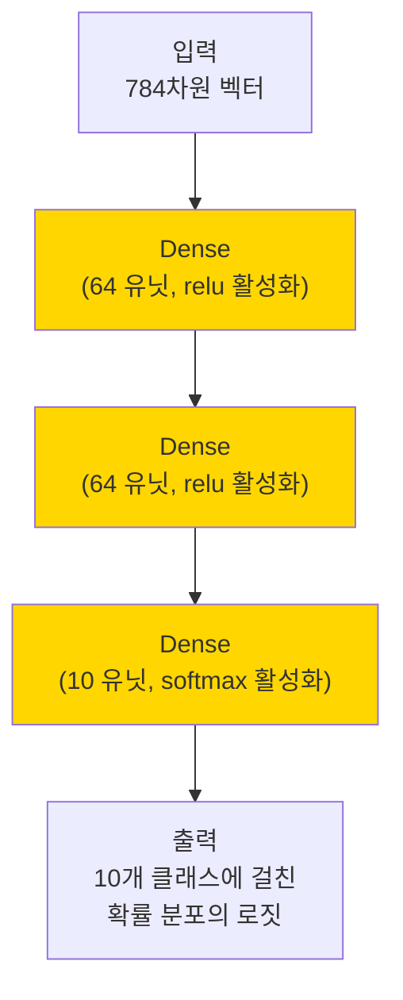
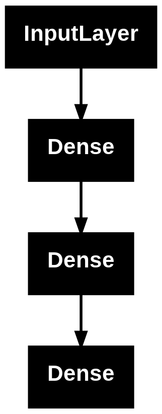
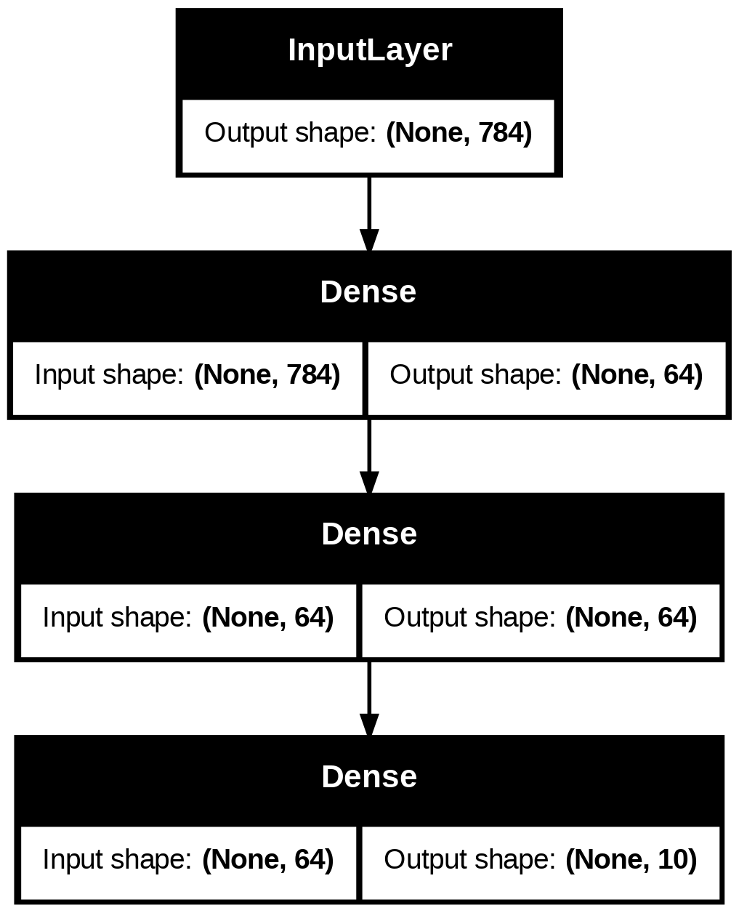

## 개요

Keras Functional API는 [`keras.Sequential`](/docs/model/creation/sequential_api/) API보다 더 유연한 모델을 생성하는 방법입니다. Functional API는 비선형 토폴로지, 공유 레이어, 심지어 다중 입력 또는 출력이 포함된 모델을 처리할 수 있습니다.

주요 아이디어는 딥러닝 모델이 일반적으로 레이어의 방향성 비순환 그래프(DAG)라는 것입니다. 따라서, Functional API는 레이어 그래프를 작성하는 방법입니다.

### Functional API 모델

다음 모델을 고려해봅시다.



3개의 레이어(노란색 `Dense` 레이어)로 구성된 기본 그래프입니다. Functional API를 사용하여 이 모델을 빌드하려면, 입력 노드를 생성하는 것으로 시작하십시오.

```python
inputs = keras.Input(shape=(784,))
```

데이터의 모양은 784차원 벡터로 설정됩니다. 각 샘플의 모양만 지정되므로, 배치 크기는 항상 생략됩니다.

예를 들어, `(32, 32, 3)` 모양의 이미지 입력이 있는 경우, 다음을 사용합니다.

```
# 시연 목적으로만 사용됩니다.
img_inputs = keras.Input(shape=(32, 32, 3))
```

반환되는 `inputs`에는 모델에 제공하는 입력 데이터의 모양 및 `dtype`에 대한 정보가 포함되어 있습니다. 모양은 다음과 같습니다.

```python
inputs.shape
```

{}

```plain
(None, 784)
```

{}

`dtype`은 다음과 같습니다.

```python
inputs.dtype
```

{}

```plain
'float32'
```

{}

이 `inputs` 객체에 대해 레이어를 호출하여, 레이어 그래프에 새 노드를 만듭니다.

```python
dense = layers.Dense(64, activation="relu")
x = dense(inputs)
```

"레이어 호출" 작업은 "inputs"에서 시작하여, 생성한 이 레이어로 화살표를 그리는 것과 같습니다. 입력을 `dense` 레이어에 "전달"하고, `x`를 출력으로 얻습니다.

레이어 그래프에 레이어를 몇 개 더 추가해 보겠습니다.

```python
x = layers.Dense(64, activation="relu")(x)
outputs = layers.Dense(10)(x)
```

이 시점에서, 레이어 그래프에 입력과 출력을 지정하여 `Model`을 생성할 수 있습니다.

```python
model = keras.Model(inputs=inputs, outputs=outputs, name="mnist_model")
```

### 모델 요약 및 플롯

모델 요약이 어떻게 보이는지 확인해 보겠습니다.

```python
import keras
from keras import layers

inputs = keras.Input(shape=(784,))
dense = layers.Dense(64, activation="relu")
x = dense(inputs)
x = layers.Dense(64, activation="relu")(x)
outputs = layers.Dense(10)(x)

model = keras.Model(inputs=inputs, outputs=outputs, name="mnist_model")
```

```python
model.summary()
```

{}

```plain
Model: "mnist_model"
┏━━━━━━━━━━━━━━━━━━━━━━━━━━━━━━━━━━━━━━┳━━━━━━━━━━━━━━━━━━━━━━━━━━━━━┳━━━━━━━━━━━━━━━━━┓
┃ Layer (type)                         ┃ Output Shape                ┃         Param # ┃
┡━━━━━━━━━━━━━━━━━━━━━━━━━━━━━━━━━━━━━━╇━━━━━━━━━━━━━━━━━━━━━━━━━━━━━╇━━━━━━━━━━━━━━━━━┩
│ input_layer_5 (InputLayer)           │ (None, 784)                 │               0 │
├──────────────────────────────────────┼─────────────────────────────┼─────────────────┤
│ dense_10 (Dense)                     │ (None, 64)                  │          50,240 │
├──────────────────────────────────────┼─────────────────────────────┼─────────────────┤
│ dense_11 (Dense)                     │ (None, 64)                  │           4,160 │
├──────────────────────────────────────┼─────────────────────────────┼─────────────────┤
│ dense_12 (Dense)                     │ (None, 10)                  │             650 │
└──────────────────────────────────────┴─────────────────────────────┴─────────────────┘
 Total params: 55,050 (215.04 KB)
 Trainable params: 55,050 (215.04 KB)
 Non-trainable params: 0 (0.00 B)
```

{}

또한, 모델을 플롯할 수 있습니다.

```python
keras.utils.plot_model(model, "my_first_model.png")
```



입츨력 모양도 추가하여 플롯 가능합니다.

```python
keras.utils.plot_model(model, "my_first_model_with_shape_info.png", show_shapes=True)
```



이 그림과 코드는 거의 동일합니다. 코드 버전에서는 연결 화살표가 호출 작업으로 대체됩니다.

"레이어 그래프"는 딥러닝 모델에 대한 직관적인 정신적 이미지이며, Functional API는 이를 밀접하게 반영하는 모델을 만드는 방법입니다.
