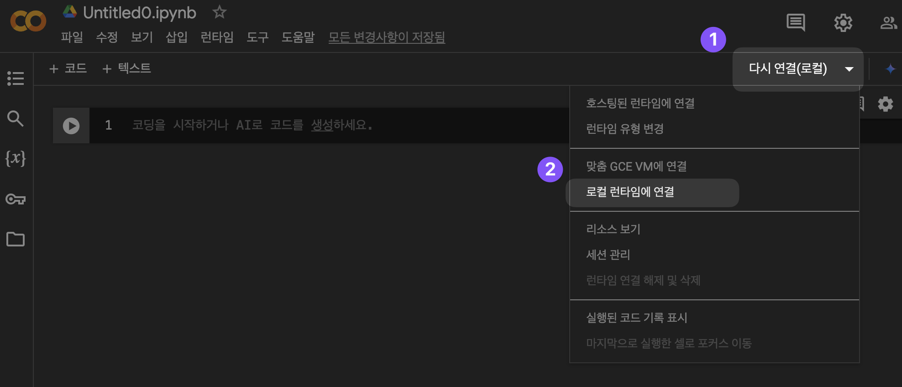
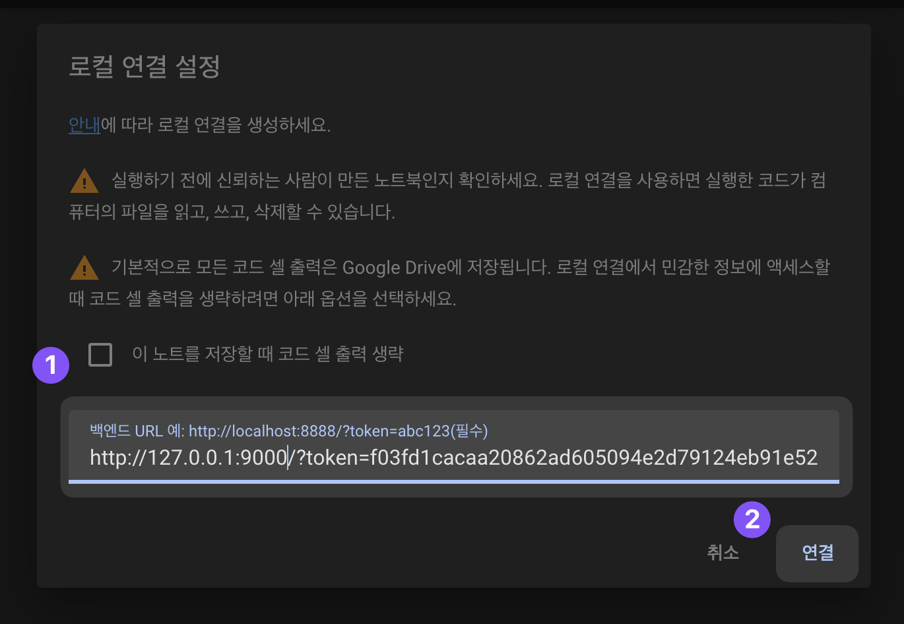

## Colab 로컬 서버에서 활용하기

Colab 사이트에서는 로컬 런타임으로 설정하는 방법에 대한 안내[^1]가 있습니다.

두 가지 방법이 나와 있지만, 여기에서는 Colab Docker 런타임 이미지를 기준으로 설명합니다. GPU 지원 기준입니다.

1. 로컬 머신에 Docker를 설치
2. 런타임 시작 (with NVIDIA 드라이버, NVIDIA Container Toolkit)

문서에서는 이 명령을 실행하도록 되어 있습니다. (여기에서는 아시아 서버인 `asia-docker.pkg.dev`를 사용하였습니다.)

```shell
docker run --gpus=all -p 127.0.0.1:9000:8080 asia-docker.pkg.dev/colab-images/public/runtime
```

다만, 이는 TensorFlow 기준이기 때문에, Keras 3 버전을 활용하기 위해서는 약간 변형이 필요합니다.
다음의 옵션이 있습니다.

1. Colab에서 매번 Keras 3을 설치
2. `colab-image`를 기반으로 추가 이미지 제작

여기에서는 두 번째 방법인 추가 이미지 제작을 기반으로 설명합니다.

## Docker로 Keras 3 Colab 로컬 런타임 실행

TensorFlow에서는 Keras 3을 지원하지 않으므로, 별도로 설치가 필요합니다.

추가로 Jax를 지원하도록 설정할 수도 있습니다.

{}

### Docker 이미지 만들기

다음과 같이 Dockerfile을 생성합니다.

```Docker {filename="Dockerfile-colab_jax_with_gpu"}
# 아시아 Colab 런타임 이미지 기반
FROM asia-docker.pkg.dev/colab-images/public/runtime:latest

# JAX GPU 버전 설치 (CUDA 호환)
RUN pip install --upgrade pip
RUN pip install jax[cuda] -f https://storage.googleapis.com/jax-releases/jax_cuda_releases.html

# 필요 없는 패키지 제거 (tf-keras 등)
RUN pip uninstall -y tf-keras

# 호환되는 TensorFlow 및 Keras 설치
RUN pip install --upgrade keras-cv
RUN pip install --upgrade keras-nlp
RUN pip install --upgrade keras-tuner
RUN pip install --upgrade keras==3.4.1 --root-user-action=ignore
#RUN pip install --upgrade keras --root-user-action=ignore

# 노트북을 실행할 포트 지정
EXPOSE 8080

# Jupyter 노트북 자동 실행 및 token 설정
CMD ["bash", "-c", "jupyter notebook --ip=0.0.0.0 --port=8080 --no-browser --allow-root"]
```

### Docker 이미지 빌드

Docker를 빌드합니다.

```shell
docker build -f Dockerfile-colab_jax_with_gpu -t my-colab-runtime-with-jax-gpu .
```

### Docker 컨테이너 실행

다음과 같이 컨테이너를 실행합니다.

```shell
docker run --gpus=all -p 127.0.0.1:9000:8080 my-colab-runtime-with-jax-gpu
```

런타임을 실행하면 다음과 같이 나타납니다.

```text {hl_lines=[10]}
...

[2024-11-16T10:21:57.080Z]  INFO: app/1 on 360a48cc36a2:  or http://127.0.0.1:9000/?token=56d7a76f03b5644dc3a4e8d2f879adf3928f0fb52880a368 (type=jupyter)
[2024-11-16T10:21:57.080Z]  INFO: app/1 on 360a48cc36a2: Use Control-C to stop this server and shut down all kernels (twice to skip confirmation). (type=jupyter)
[2024-11-16T10:21:57.082Z] ERROR: app/1 on 360a48cc36a2:  (type=jupyter)
[2024-11-16T10:21:57.082Z]  WARN: app/1 on 360a48cc36a2:     To access the notebook, open this file in a browser: (type=jupyter)
[2024-11-16T10:21:57.082Z]  WARN: app/1 on 360a48cc36a2:         file:///root/.local/share/jupyter/runtime/nbserver-88-open.html (type=jupyter)
[2024-11-16T10:21:57.082Z]  WARN: app/1 on 360a48cc36a2:     Or copy and paste one of these URLs: (type=jupyter)
[2024-11-16T10:21:57.082Z]  WARN: app/1 on 360a48cc36a2:         http://127.0.0.1:9000/?token=56d7a76f03b5644dc3a4e8d2f879adf3928f0fb52880a368 (type=jupyter)
[2024-11-16T10:21:57.082Z]  WARN: app/1 on 360a48cc36a2:      or http://127.0.0.1:9000/?token=56d7a76f03b5644dc3a4e8d2f879adf3928f0fb52880a368 (type=jupyter)

...
```

여기에서, `http://127.0.0.1:9000/?token=56d7a76f03b5644dc3a4e8d2f879adf3928f0fb52880a368` 이렇게 나타나는 부분이 필요합니다. `token` 값은 매번 실행마다 바뀌기 때문에, 매번 실행할 때마다 변경되는 값을 활용해야 합니다.

### Colab 로컬 런타임 시작

Google Drive에서 혹은 단독으로 Colab을 실행하고, 로컬 런타임 연결을 진행합니다.



이후, 아까 복사한 토큰을 포함한 주소를 붙여넣어 연결합니다.



이제 Colab에서 Keras 3 로컬 서버를 활용할 수 있습니다.

{}

[^1]: Colab 로컬 런타임 안내 https://research.google.com/colaboratory/local-runtimes.html
