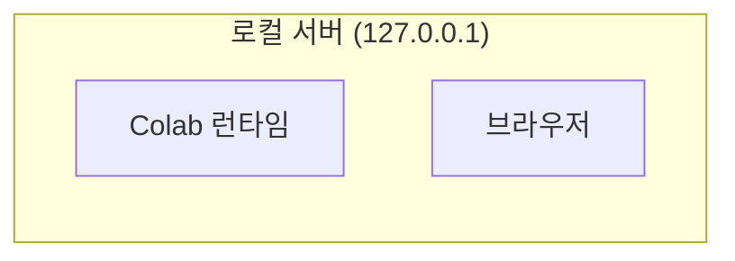
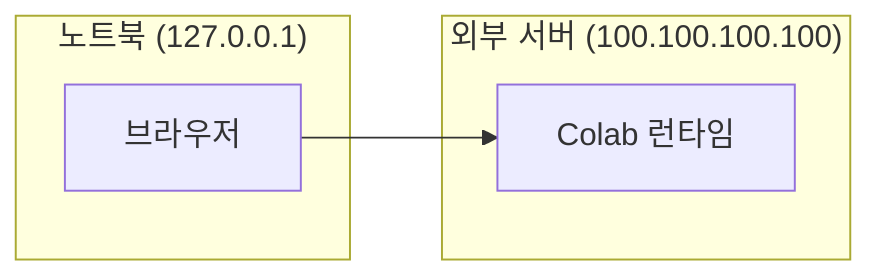
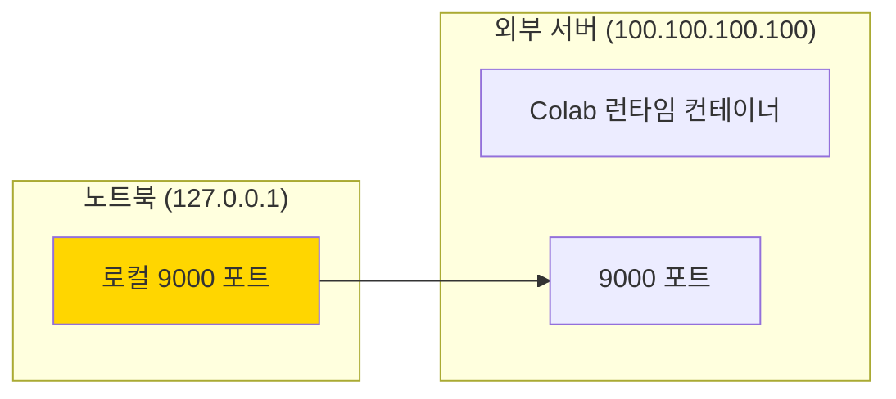
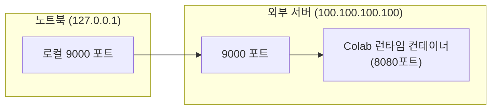
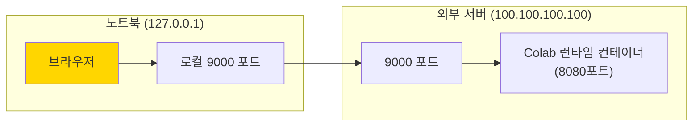

## 개요

Colab을 로컬 서버에서 사용하는 것은 방금 보았던 [Colab Local](/docs/tips/colab/colab_local/) 문서와 같이, Docker를 통한 Colab 컨테이너를 실행한 다음, 이를 Colab 사이트에서 로컬 런타임으로 연결하면 됩니다.



다만, 외부에서 노트북을 가지고 있는데, 별도의 서버가 있어 그 서버를 Colab 사이트의 로컬 런타임으로 활용하려면 다른 방식이 필요합니다.



이런 식으로 사용할 수 있을 것 같은데, Colab 문서에서 로컬 호스트 주소에 외부 주소인 `100.100.100.100`를 넣으면, 동작하지 않습니다. localhost 이외의 주소는 받아들이지 않기 때문입니다.


이 방법은 [Colab Local](/docs/tips/colab/colab_local/) 문서에 있는 것을 완료한 후, 추가적으로 수행하는 방식입니다. 이를 통해 외부 서버에서 접근이 가능합니다.

여기에서는 다음과 같은 내용을 다룹니다.

1. 외부 서버를 통해 Colab을 로컬 환경처럼 사용하는 방법
2. tmux로 세션을 관리하는 방법
3. Docker로 Colab 런타임 컨테이너를 실행하는 방법
4. 그리고 Colab에서 로컬 런타임을 활용하는 방법에 대해 다룹니다.

## 필요한 것들

- ssh 터미널 : 외부로 연결을 하기 위해 필요합니다.
- tmux : 세션 제어를 위해 필요합니다.

## 외부 서버를 활용한 Colab 로컬 런타임 실행

{}

### [로컬] ssh로 외부 서버 접속



먼저 로컬의 터미널에서 외부 서버로 접속이 필요합니다.

```shell
ssh -L [포워딩할 로컬 포트]:localhost:[연결할 외부 포트] [외부 서버 계정]@[외부 서버 주소] -p [ssh 포트]
```

명령은 이와 같이 수행되며,

```shell
ssh -L 9000:localhost:9000 as@abc.com -p 8027
```

이렇게 수행되면, ssh로 외부 서버로 접속되어 있는 한, 외부 서버의 9000번 포트가 로컬 서버의 9000번 포트로 인식이 가능합니다.

### [서버] tmux 세션 실행

이렇게 접속 후, 바로 [Colab Local](/docs/tips/colab/colab_local/)에서처럼 Docker 컨테이너를 바로 실행할 수도 있지만, 별도의 세션을 만들어서 관리하는 방식이 저에게는 더 나았습니다.

#### tmux 세션 만들기

그래서, 별도로 `colab_session`이라는 세션을 만들어서, 세션을 통해 간접적으로 실행하는 방식입니다.

```shell
tmux new -s colab_session
```

이렇게 하면, 세션을 만들 수 있습니다.

#### tmux 세션 나가기

세션 종료가 아니며, 만든 세션은 그대로 둔 채 나가는 방법입니다.

세션에 연결된 상태에서, `Ctrl` + `B`, `D`를 누르면, 세션에서 나갈 수 있습니다.

#### tmux 세션 목록 보기

```shell
tmux ls
```

세션의 목록을 볼 수 있습니다.

{}

colab_session: 1 windows (created Sat Nov 16 19:21:36 2024)

{}

#### tmux 세션 재접속

```shell
tmux a -t colab_session
```

이런 식으로 기존에 생성되었던 세션에 재연결을 할 수 있습니다.

#### (참고) tmux 세션 종료

```shell
tmux kill-session -t colab_session
```

이런 식으로 tmux 세션을 종료할 수 있습니다.

다만, 이렇게 종료하면, docker 컨테이너는 남아 있습니다. docker 컨테이너는 별도로 없애주어야 합니다.

### [서버] Colab Docker 컨테이너 실행

이제 이전과 같이 Colab Docker 컨테이너를 실행합니다.

```shell
docker run --gpus=all -p 127.0.0.1:9000:8080 my-colab-runtime-with-jax-gpu
```

(ssh로 연결 명령으로) 로컬의 9000번 포트가 서버의 9000번 포트를 가리키고 있었는데,
이 명령의 수행으로, 서버의 9000번 포트는 Colab 컨테이너의 8080번 포트를 가리킵니다.



즉, 이제 로컬에서 9000번 포트를 가리키게 되면, 이는 Colab 런타임 컨테이너의 8080번 포트를 가리키게 되어, 로컬 포트를 지정하는 것이 서버 포트를 지정하는 것과 동일한 효과를 가지게 됩니다.

### [로컬] Colab 실행하기


이제 Colab을 서버로 실행할 수 있습니다. 여기에서, localhost의 9000번 주소는 결국, 서버의 Colab 컨테이너를 가리키게 됩니다.




{}
