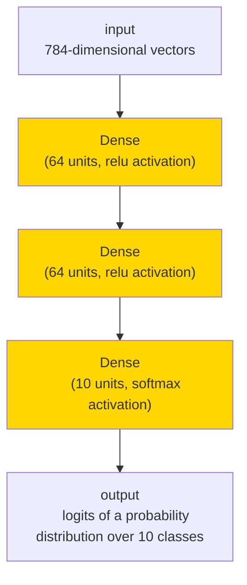



**** [fchollet](https://twitter.com/fchollet)  
**** 2019/03/01  
**** 2023/06/25  
**** 함수형 API에 대한 완벽 가이드.






## 셋업 {#setup}

```python
import numpy as np
import keras
from keras import layers
from keras import ops
```

## 소개 {#introduction}

Keras _함수형 API_ 는 [`keras.Sequential`]() API보다 더 유연한 모델을 만드는 방법입니다.
함수형 API는 비선형 토폴로지, 공유 레이어, 심지어 여러 입력이나 출력이 있는 모델을 다룰 수 있습니다.

주요 아이디어는 딥러닝 모델이 일반적으로 레이어의 방향성이 있는 비순환 그래프(DAG, directed acyclic graph)라는 것입니다.
따라서 함수형 API는 _레이어 그래프_ 를 빌드하는 방법입니다.

### 함수형 API 모델 {#functional-api-model}

다음 모델을 생각해봅시다.



이것은 3개의 레이어(노란색 `Dense` 레이어)가 있는 기본 그래프입니다.
함수형 API를 사용하여 이 모델을 빌드하려면, 먼저 입력 노드를 만듭니다.

```python
inputs = keras.Input(shape=(784,))
```

데이터 모양은 784차원 벡터로 설정됩니다.
각 샘플의 모양만 지정되므로, 배치 크기는 항상 생략됩니다.

예를 들어, `(32, 32, 3)` 모양의 이미지 입력이 있는 경우, 다음을 사용합니다.

```
# 단지 데모 목적입니다.
img_inputs = keras.Input(shape=(32, 32, 3))
```

반환된 `inputs`에는 모델에 공급하는 입력 데이터의 모양과 `dtype`에 대한 정보가 들어 있습니다.
모양은 다음과 같습니다.

```python
inputs.shape
```

{}

```plain
(None, 784)
```

{}

dtype은 다음과 같습니다.

```python
inputs.dtype
```

{}

```plain
'float32'
```

{}

이 `inputs` 객체에서 레이어를 호출하여, 레이어 그래프에 새 노드를 만듭니다.

```python
dense = layers.Dense(64, activation="relu")
x = dense(inputs)
```

"레이어 호출" 작업은 "inputs"에서 생성한 이 레이어로 화살표를 그리는 것과 같습니다.
입력을 `dense` 레이어로 "전달"하고, 출력으로 `x`를 얻습니다.

레이어 그래프에 몇 개의 레이어를 더 추가해 보겠습니다.

```python
x = layers.Dense(64, activation="relu")(x)
outputs = layers.Dense(10)(x)
```

이 시점에서, 그래프 레이어에 입력과 출력을 지정하여 `Model`을 생성할 수 있습니다.

```python
model = keras.Model(inputs=inputs, outputs=outputs, name="mnist_model")
```

### 모델 요약 & 플롯 {#model-summary-and-plot}

모델 요약이 어떤지 살펴보겠습니다.

```python
import keras
from keras import layers

inputs = keras.Input(shape=(784,))
dense = layers.Dense(64, activation="relu")
x = dense(inputs)
x = layers.Dense(64, activation="relu")(x)
outputs = layers.Dense(10)(x)

model = keras.Model(inputs=inputs, outputs=outputs, name="mnist_model")
```

```python
model.summary()
```

{}

```plain
Model: "mnist_model"
┏━━━━━━━━━━━━━━━━━━━━━━━━━━━━━━━━━━━━━━┳━━━━━━━━━━━━━━━━━━━━━━━━━━━━━┳━━━━━━━━━━━━━━━━━┓
┃ Layer (type)                         ┃ Output Shape                ┃         Param # ┃
┡━━━━━━━━━━━━━━━━━━━━━━━━━━━━━━━━━━━━━━╇━━━━━━━━━━━━━━━━━━━━━━━━━━━━━╇━━━━━━━━━━━━━━━━━┩
│ input_layer_5 (InputLayer)           │ (None, 784)                 │               0 │
├──────────────────────────────────────┼─────────────────────────────┼─────────────────┤
│ dense_10 (Dense)                     │ (None, 64)                  │          50,240 │
├──────────────────────────────────────┼─────────────────────────────┼─────────────────┤
│ dense_11 (Dense)                     │ (None, 64)                  │           4,160 │
├──────────────────────────────────────┼─────────────────────────────┼─────────────────┤
│ dense_12 (Dense)                     │ (None, 10)                  │             650 │
└──────────────────────────────────────┴─────────────────────────────┴─────────────────┘
 Total params: 55,050 (215.04 KB)
 Trainable params: 55,050 (215.04 KB)
 Non-trainable params: 0 (0.00 B)
```

{}

모델을 그래프로 표시할 수도 있습니다.

```python
keras.utils.plot_model(model, "my_first_model.png")
```


그리고, 선택적으로, 플롯된 그래프에 각 레이어의 입력 및 출력 모양을 표시합니다.

```python
keras.utils.plot_model(model, "my_first_model_with_shape_info.png", show_shapes=True)
```


이 그림과 코드는 거의 동일합니다. 코드 버전에서는, 연결 화살표가 호출 연산으로 대체되었습니다.

"레이어 그래프"는 딥러닝 모델에 대한 직관적인 정신적 이미지이며,
함수형 API는 이를 밀접하게 반영하는 모델을 만드는 방법입니다.

## 트레이닝, 평가 및 추론 {#training-evaluation-and-inference}

트레이닝, 평가 및 추론은 함수형 API를 사용하여 빌드된 모델에서,
`Sequential` 모델과 정확히 동일한 방식으로 작동합니다.

`Model` 클래스는 빌트인 트레이닝 루프(`fit()` 메서드)와 빌트인 평가 루프(`evaluate()` 메서드)를 제공합니다.
이러한 루프를 쉽게 커스터마이즈하여, 당신만의 트레이닝 루틴을 구현할 수 있습니다.
`fit()`에서 발생하는 작업을 커스터마이즈하는 방법에 대한 가이드도 참조하세요.

- [TensorFlow로 커스텀 트레이닝 단계 작성]()
- [JAX로 커스텀 트레이닝 단계 작성]()
- [PyTorch로 커스텀 트레이닝 단계 작성]()

여기서, MNIST 이미지 데이터를 로드하고, 벡터로 reshape하고,
(검증 분할에서 성능을 모니터링하면서) 데이터에 대해 fit한 다음,
테스트 데이터에 대해 모델을 평가합니다.

```python
(x_train, y_train), (x_test, y_test) = keras.datasets.mnist.load_data()

x_train = x_train.reshape(60000, 784).astype("float32") / 255
x_test = x_test.reshape(10000, 784).astype("float32") / 255

model.compile(
    loss=keras.losses.SparseCategoricalCrossentropy(from_logits=True),
    optimizer=keras.optimizers.RMSprop(),
    metrics=["accuracy"],
)

history = model.fit(x_train, y_train, batch_size=64, epochs=2, validation_split=0.2)

test_scores = model.evaluate(x_test, y_test, verbose=2)
print("Test loss:", test_scores[0])
print("Test accuracy:", test_scores[1])
```

{}

```plain
Epoch 1/2
 750/750 ━━━━━━━━━━━━━━━━━━━━ 1s 863us/step - accuracy: 0.8425 - loss: 0.5733 - val_accuracy: 0.9496 - val_loss: 0.1711
Epoch 2/2
 750/750 ━━━━━━━━━━━━━━━━━━━━ 1s 859us/step - accuracy: 0.9509 - loss: 0.1641 - val_accuracy: 0.9578 - val_loss: 0.1396
313/313 - 0s - 341us/step - accuracy: 0.9613 - loss: 0.1288
Test loss: 0.12876172363758087
Test accuracy: 0.9613000154495239
```

{}

자세한 내용은 [트레이닝 및 평가]() 가이드를 참조하세요.

## 저장 및 직렬화 {#save-and-serialize}

모델 저장 및 직렬화는 `Sequential` 모델과 마찬가지로,
함수형 API를 사용하여 빌드한 모델에 대해서도 동일한 방식으로 작동합니다.
함수형 모델을 저장하는 표준 방법은 `model.save()`를 호출하여,
전체 모델을 단일 파일로 저장하는 것입니다.
심지어 나중에 모델을 빌드한 코드를 더 이상 사용할 수 없더라도,
이 파일에서 동일한 모델을 다시 만들 수 있습니다.

이 저장된 파일에는 다음이 포함됩니다.

- 모델 아키텍처
- 모델 가중치 값(트레이닝 중에 학습한 값)
- 모델 트레이닝 구성(있는 경우, `compile()`에 전달됨)
- 옵티마이저 및 해당 상태(있는 경우, 중단한 지점에서 트레이닝을 다시 시작하기 위함)

```python
model.save("my_model.keras")
del model
# 파일에서 정확히 동일한 모델을 재생성합니다.
model = keras.models.load_model("my_model.keras")
```

자세한 내용은 모델 [직렬화 및 저장]() 가이드를 읽어보세요.

## 동일한 레이어 그래프를 사용하여 여러 모델 정의 {#use-the-same-graph-of-layers-to-define-multiple-models}

함수형 API에서, 모델은 레이어 그래프에서 입력과 출력을 지정하여 생성됩니다.
즉, 레이어의 단일 그래프를 사용하여 여러 모델을 생성할 수 있습니다.

아래 예에서, 동일한 레이어 스택을 사용하여 두 모델을 인스턴스화합니다.

- (1) 이미지 입력을 16차원 벡터로 변환하는 `encoder` 모델과
- (2) 트레이닝을 위한 엔드투엔드 `autoencoder` 모델입니다.

```python
encoder_input = keras.Input(shape=(28, 28, 1), name="img")
x = layers.Conv2D(16, 3, activation="relu")(encoder_input)
x = layers.Conv2D(32, 3, activation="relu")(x)
x = layers.MaxPooling2D(3)(x)
x = layers.Conv2D(32, 3, activation="relu")(x)
x = layers.Conv2D(16, 3, activation="relu")(x)
encoder_output = layers.GlobalMaxPooling2D()(x)

encoder = keras.Model(encoder_input, encoder_output, name="encoder")
encoder.summary()

x = layers.Reshape((4, 4, 1))(encoder_output)
x = layers.Conv2DTranspose(16, 3, activation="relu")(x)
x = layers.Conv2DTranspose(32, 3, activation="relu")(x)
x = layers.UpSampling2D(3)(x)
x = layers.Conv2DTranspose(16, 3, activation="relu")(x)
decoder_output = layers.Conv2DTranspose(1, 3, activation="relu")(x)

autoencoder = keras.Model(encoder_input, decoder_output, name="autoencoder")
autoencoder.summary()
```

{}

```plain
Model: "encoder"
┏━━━━━━━━━━━━━━━━━━━━━━━━━━━━━━━━━┳━━━━━━━━━━━━━━━━━━━━━━━━┳━━━━━━━━━━━━━━━┓
┃ Layer (type)                    ┃ Output Shape           ┃       Param # ┃
┡━━━━━━━━━━━━━━━━━━━━━━━━━━━━━━━━━╇━━━━━━━━━━━━━━━━━━━━━━━━╇━━━━━━━━━━━━━━━┩
│ img (InputLayer)                │ (None, 28, 28, 1)      │             0 │
├─────────────────────────────────┼────────────────────────┼───────────────┤
│ conv2d (Conv2D)                 │ (None, 26, 26, 16)     │           160 │
├─────────────────────────────────┼────────────────────────┼───────────────┤
│ conv2d_1 (Conv2D)               │ (None, 24, 24, 32)     │         4,640 │
├─────────────────────────────────┼────────────────────────┼───────────────┤
│ max_pooling2d (MaxPooling2D)    │ (None, 8, 8, 32)       │             0 │
├─────────────────────────────────┼────────────────────────┼───────────────┤
│ conv2d_2 (Conv2D)               │ (None, 6, 6, 32)       │         9,248 │
├─────────────────────────────────┼────────────────────────┼───────────────┤
│ conv2d_3 (Conv2D)               │ (None, 4, 4, 16)       │         4,624 │
├─────────────────────────────────┼────────────────────────┼───────────────┤
│ global_max_pooling2d            │ (None, 16)             │             0 │
│ (GlobalMaxPooling2D)            │                        │               │
└─────────────────────────────────┴────────────────────────┴───────────────┘
 Total params: 18,672 (72.94 KB)
 Trainable params: 18,672 (72.94 KB)
 Non-trainable params: 0 (0.00 B)
Model: "autoencoder"
┏━━━━━━━━━━━━━━━━━━━━━━━━━━━━━━━━━┳━━━━━━━━━━━━━━━━━━━━━━━━┳━━━━━━━━━━━━━━━┓
┃ Layer (type)                    ┃ Output Shape           ┃       Param # ┃
┡━━━━━━━━━━━━━━━━━━━━━━━━━━━━━━━━━╇━━━━━━━━━━━━━━━━━━━━━━━━╇━━━━━━━━━━━━━━━┩
│ img (InputLayer)                │ (None, 28, 28, 1)      │             0 │
├─────────────────────────────────┼────────────────────────┼───────────────┤
│ conv2d (Conv2D)                 │ (None, 26, 26, 16)     │           160 │
├─────────────────────────────────┼────────────────────────┼───────────────┤
│ conv2d_1 (Conv2D)               │ (None, 24, 24, 32)     │         4,640 │
├─────────────────────────────────┼────────────────────────┼───────────────┤
│ max_pooling2d (MaxPooling2D)    │ (None, 8, 8, 32)       │             0 │
├─────────────────────────────────┼────────────────────────┼───────────────┤
│ conv2d_2 (Conv2D)               │ (None, 6, 6, 32)       │         9,248 │
├─────────────────────────────────┼────────────────────────┼───────────────┤
│ conv2d_3 (Conv2D)               │ (None, 4, 4, 16)       │         4,624 │
├─────────────────────────────────┼────────────────────────┼───────────────┤
│ global_max_pooling2d            │ (None, 16)             │             0 │
│ (GlobalMaxPooling2D)            │                        │               │
├─────────────────────────────────┼────────────────────────┼───────────────┤
│ reshape (Reshape)               │ (None, 4, 4, 1)        │             0 │
├─────────────────────────────────┼────────────────────────┼───────────────┤
│ conv2d_transpose                │ (None, 6, 6, 16)       │           160 │
│ (Conv2DTranspose)               │                        │               │
├─────────────────────────────────┼────────────────────────┼───────────────┤
│ conv2d_transpose_1              │ (None, 8, 8, 32)       │         4,640 │
│ (Conv2DTranspose)               │                        │               │
├─────────────────────────────────┼────────────────────────┼───────────────┤
│ up_sampling2d (UpSampling2D)    │ (None, 24, 24, 32)     │             0 │
├─────────────────────────────────┼────────────────────────┼───────────────┤
│ conv2d_transpose_2              │ (None, 26, 26, 16)     │         4,624 │
│ (Conv2DTranspose)               │                        │               │
├─────────────────────────────────┼────────────────────────┼───────────────┤
│ conv2d_transpose_3              │ (None, 28, 28, 1)      │           145 │
│ (Conv2DTranspose)               │                        │               │
└─────────────────────────────────┴────────────────────────┴───────────────┘
 Total params: 28,241 (110.32 KB)
 Trainable params: 28,241 (110.32 KB)
 Non-trainable params: 0 (0.00 B)
```

{}

여기서, 디코딩 아키텍처는 인코딩 아키텍처와 엄격히 대칭적이므로,
출력 모양은 입력 모양 `(28, 28, 1)`과 동일합니다.

`Conv2D` 레이어의 역은 `Conv2DTranspose` 레이어이고,
`MaxPooling2D` 레이어의 역은 `UpSampling2D` 레이어입니다.

## 모든 모델은 (레이어와 마찬가지로) 호출 가능합니다. {#all-models-are-callable-just-like-layers}

`Input` 또는 다른 레이어의 출력에서 ​​호출하여, 모든 모델을 레이어인 것처럼 취급할 수 있습니다.
모델을 호출하면 모델의 아키텍처를 재사용하는 것뿐만 아니라, 가중치도 재사용하는 것입니다.

이를 실제로 보려면, 인코더 모델, 디코더 모델을 만들고, 두 호출로 체인하여,
오토인코더 모델을 얻는 오토인코더 예제에 대한 다른 방법이 있습니다.

```python
encoder_input = keras.Input(shape=(28, 28, 1), name="original_img")
x = layers.Conv2D(16, 3, activation="relu")(encoder_input)
x = layers.Conv2D(32, 3, activation="relu")(x)
x = layers.MaxPooling2D(3)(x)
x = layers.Conv2D(32, 3, activation="relu")(x)
x = layers.Conv2D(16, 3, activation="relu")(x)
encoder_output = layers.GlobalMaxPooling2D()(x)

encoder = keras.Model(encoder_input, encoder_output, name="encoder")
encoder.summary()

decoder_input = keras.Input(shape=(16,), name="encoded_img")
x = layers.Reshape((4, 4, 1))(decoder_input)
x = layers.Conv2DTranspose(16, 3, activation="relu")(x)
x = layers.Conv2DTranspose(32, 3, activation="relu")(x)
x = layers.UpSampling2D(3)(x)
x = layers.Conv2DTranspose(16, 3, activation="relu")(x)
decoder_output = layers.Conv2DTranspose(1, 3, activation="relu")(x)

decoder = keras.Model(decoder_input, decoder_output, name="decoder")
decoder.summary()

autoencoder_input = keras.Input(shape=(28, 28, 1), name="img")
encoded_img = encoder(autoencoder_input)
decoded_img = decoder(encoded_img)
autoencoder = keras.Model(autoencoder_input, decoded_img, name="autoencoder")
autoencoder.summary()
```

{}

```plain
Model: "encoder"
┏━━━━━━━━━━━━━━━━━━━━━━━━━━━━━━━━━┳━━━━━━━━━━━━━━━━━━━━━━━━┳━━━━━━━━━━━━━━━┓
┃ Layer (type)                    ┃ Output Shape           ┃       Param # ┃
┡━━━━━━━━━━━━━━━━━━━━━━━━━━━━━━━━━╇━━━━━━━━━━━━━━━━━━━━━━━━╇━━━━━━━━━━━━━━━┩
│ original_img (InputLayer)       │ (None, 28, 28, 1)      │             0 │
├─────────────────────────────────┼────────────────────────┼───────────────┤
│ conv2d_4 (Conv2D)               │ (None, 26, 26, 16)     │           160 │
├─────────────────────────────────┼────────────────────────┼───────────────┤
│ conv2d_5 (Conv2D)               │ (None, 24, 24, 32)     │         4,640 │
├─────────────────────────────────┼────────────────────────┼───────────────┤
│ max_pooling2d_1 (MaxPooling2D)  │ (None, 8, 8, 32)       │             0 │
├─────────────────────────────────┼────────────────────────┼───────────────┤
│ conv2d_6 (Conv2D)               │ (None, 6, 6, 32)       │         9,248 │
├─────────────────────────────────┼────────────────────────┼───────────────┤
│ conv2d_7 (Conv2D)               │ (None, 4, 4, 16)       │         4,624 │
├─────────────────────────────────┼────────────────────────┼───────────────┤
│ global_max_pooling2d_1          │ (None, 16)             │             0 │
│ (GlobalMaxPooling2D)            │                        │               │
└─────────────────────────────────┴────────────────────────┴───────────────┘
 Total params: 18,672 (72.94 KB)
 Trainable params: 18,672 (72.94 KB)
 Non-trainable params: 0 (0.00 B)
Model: "decoder"
┏━━━━━━━━━━━━━━━━━━━━━━━━━━━━━━━━━┳━━━━━━━━━━━━━━━━━━━━━━━━┳━━━━━━━━━━━━━━━┓
┃ Layer (type)                    ┃ Output Shape           ┃       Param # ┃
┡━━━━━━━━━━━━━━━━━━━━━━━━━━━━━━━━━╇━━━━━━━━━━━━━━━━━━━━━━━━╇━━━━━━━━━━━━━━━┩
│ encoded_img (InputLayer)        │ (None, 16)             │             0 │
├─────────────────────────────────┼────────────────────────┼───────────────┤
│ reshape_1 (Reshape)             │ (None, 4, 4, 1)        │             0 │
├─────────────────────────────────┼────────────────────────┼───────────────┤
│ conv2d_transpose_4              │ (None, 6, 6, 16)       │           160 │
│ (Conv2DTranspose)               │                        │               │
├─────────────────────────────────┼────────────────────────┼───────────────┤
│ conv2d_transpose_5              │ (None, 8, 8, 32)       │         4,640 │
│ (Conv2DTranspose)               │                        │               │
├─────────────────────────────────┼────────────────────────┼───────────────┤
│ up_sampling2d_1 (UpSampling2D)  │ (None, 24, 24, 32)     │             0 │
├─────────────────────────────────┼────────────────────────┼───────────────┤
│ conv2d_transpose_6              │ (None, 26, 26, 16)     │         4,624 │
│ (Conv2DTranspose)               │                        │               │
├─────────────────────────────────┼────────────────────────┼───────────────┤
│ conv2d_transpose_7              │ (None, 28, 28, 1)      │           145 │
│ (Conv2DTranspose)               │                        │               │
└─────────────────────────────────┴────────────────────────┴───────────────┘
 Total params: 9,569 (37.38 KB)
 Trainable params: 9,569 (37.38 KB)
 Non-trainable params: 0 (0.00 B)
Model: "autoencoder"
┏━━━━━━━━━━━━━━━━━━━━━━━━━━━━━━━━━┳━━━━━━━━━━━━━━━━━━━━━━━━┳━━━━━━━━━━━━━━━┓
┃ Layer (type)                    ┃ Output Shape           ┃       Param # ┃
┡━━━━━━━━━━━━━━━━━━━━━━━━━━━━━━━━━╇━━━━━━━━━━━━━━━━━━━━━━━━╇━━━━━━━━━━━━━━━┩
│ img (InputLayer)                │ (None, 28, 28, 1)      │             0 │
├─────────────────────────────────┼────────────────────────┼───────────────┤
│ encoder (Functional)            │ (None, 16)             │        18,672 │
├─────────────────────────────────┼────────────────────────┼───────────────┤
│ decoder (Functional)            │ (None, 28, 28, 1)      │         9,569 │
└─────────────────────────────────┴────────────────────────┴───────────────┘
 Total params: 28,241 (110.32 KB)
 Trainable params: 28,241 (110.32 KB)
 Non-trainable params: 0 (0.00 B)
```

{}

보시다시피, 모델은 중첩될 수 있습니다.
모델은 하위 모델을 포함할 수 있습니다. (모델은 레이어와 같기 때문입니다)
모델 중첩의 일반적인 사용 사례는 _앙상블_ 입니다.
예를 들어, 다음은 여러 모델을 예측의 평균을 내는 단일 모델로 앙상블하는 방법입니다.

```python
def get_model():
    inputs = keras.Input(shape=(128,))
    outputs = layers.Dense(1)(inputs)
    return keras.Model(inputs, outputs)


model1 = get_model()
model2 = get_model()
model3 = get_model()

inputs = keras.Input(shape=(128,))
y1 = model1(inputs)
y2 = model2(inputs)
y3 = model3(inputs)
outputs = layers.average([y1, y2, y3])
ensemble_model = keras.Model(inputs=inputs, outputs=outputs)
```

## 복잡한 그래프 토폴로지 조작 {#manipulate-complex-graph-topologies}

### 여러 입력 및 출력이 있는 모델 {#models-with-multiple-inputs-and-outputs}

함수형 API를 사용하면, 여러 입력과 출력을 쉽게 조작할 수 있습니다.
이는 `Sequential` API로는 처리할 수 없습니다.

예를 들어, 우선순위에 따라 고객 문제 티켓을 순위를 매기고,
올바른 부서로 라우팅하는 시스템을 구축하는 경우, 모델에는 세 가지 입력이 있습니다.

- 티켓 제목 (텍스트 입력),
- 티켓 텍스트 본문 (텍스트 입력),
- 사용자가 추가한 어떤 태그들 (카테고리형 입력)

이 모델에는 두 가지 출력이 있습니다.

- 0~1 사이의 우선순위 점수(스칼라 sigmoid 출력),
- 티켓을 처리해야 하는 부서(부서 집합에 대한 softmax 출력).

함수형 API를 사용하면 몇 줄로 이 모델을 빌드할 수 있습니다.

```python
num_tags = 12  # 고유한 이슈 태그 수
num_words = 10000  # 텍스트 데이터를 전처리할 때, 얻은 어휘의 크기
num_departments = 4  # 예측을 위한 부서 수

title_input = keras.Input(
    shape=(None,), name="title"
)  # 가변 길이의 int 시퀀스
body_input = keras.Input(shape=(None,), name="body")  # 가변 길이의 int 시퀀스
tags_input = keras.Input(
    shape=(num_tags,), name="tags"
)  # 크기가 `num_tags`인 이진 벡터

# 제목의 각 단어를 64차원 벡터에 임베드합니다.
title_features = layers.Embedding(num_words, 64)(title_input)
# 텍스트의 각 단어를 64차원 벡터에 임베드합니다.
body_features = layers.Embedding(num_words, 64)(body_input)

# 제목에 임베드된 단어의 시퀀스를, 단일 128차원 벡터로 줄입니다.
title_features = layers.LSTM(128)(title_features)
# 본문에 포함된 단어의 시퀀스를, 단일 32차원 벡터로 줄입니다.
body_features = layers.LSTM(32)(body_features)

# 연결(concatenation)을 통해, 사용 가능한 모든 특성들을 하나의 큰 벡터로 병합합니다.
x = layers.concatenate([title_features, body_features, tags_input])

# 우선 순위 예측을 위해, 특성 위에 로지스틱 회귀를 붙입니다.
priority_pred = layers.Dense(1, name="priority")(x)
# 특성 위에 부서 분류기를 붙입니다.
department_pred = layers.Dense(num_departments, name="department")(x)

# 우선 순위와 부서를 모두 예측하는, 종단 간 모델 인스턴스화
model = keras.Model(
    inputs=[title_input, body_input, tags_input],
    outputs={"priority": priority_pred, "department": department_pred},
)
```

이제 모델을 플롯합니다.

```python
keras.utils.plot_model(model, "multi_input_and_output_model.png", show_shapes=True)
```


이 모델을 컴파일할 때, 각 출력에 다른 손실을 할당할 수 있습니다.
각 손실에 다른 가중치를 할당하여, 총 트레이닝 손실에 대한 기여도를 조절할 수도 있습니다.

```python
model.compile(
    optimizer=keras.optimizers.RMSprop(1e-3),
    loss=[
        keras.losses.BinaryCrossentropy(from_logits=True),
        keras.losses.CategoricalCrossentropy(from_logits=True),
    ],
    loss_weights=[1.0, 0.2],
)
```

출력 레이어의 이름이 다르므로,
해당 레이어 이름으로 손실 및 손실 가중치를 지정할 수도 있습니다.

```python
model.compile(
    optimizer=keras.optimizers.RMSprop(1e-3),
    loss={
        "priority": keras.losses.BinaryCrossentropy(from_logits=True),
        "department": keras.losses.CategoricalCrossentropy(from_logits=True),
    },
    loss_weights={"priority": 1.0, "department": 0.2},
)
```

입력 및 대상의 NumPy 배열 리스트를 전달하여 모델을 트레이닝합니다.

```python
# 더미 입력 데이터
title_data = np.random.randint(num_words, size=(1280, 12))
body_data = np.random.randint(num_words, size=(1280, 100))
tags_data = np.random.randint(2, size=(1280, num_tags)).astype("float32")

# 더미 타겟 데이터
priority_targets = np.random.random(size=(1280, 1))
dept_targets = np.random.randint(2, size=(1280, num_departments))

model.fit(
    {"title": title_data, "body": body_data, "tags": tags_data},
    {"priority": priority_targets, "department": dept_targets},
    epochs=2,
    batch_size=32,
)
```

{}

```plain
Epoch 1/2
 40/40 ━━━━━━━━━━━━━━━━━━━━ 3s 57ms/step - loss: 1108.3792
Epoch 2/2
 40/40 ━━━━━━━━━━━━━━━━━━━━ 2s 54ms/step - loss: 621.3049

<keras.src.callbacks.history.History at 0x34afc3d90>
```

{}

`Dataset` 객체로 fit을 호출할 때,
`([title_data, body_data, tags_data], [priority_targets, dept_targets])`와 같은 리스트 튜플이나,
`({'title': title_data, 'body': body_data, 'tags': tags_data}, {'priority': priority_targets, 'department': dept_targets})`와 같은 딕셔너리 튜플을 생성해야 합니다.

자세한 설명은 [트레이닝 및 평가]() 가이드를 참조하세요.

### 토이 ResNet 모델 {#a-toy-resnet-model}

여러 입력과 출력이 있는 모델 외에도, 함수형 API는 비선형 연결 토폴로지를 쉽게 조작할 수 있게 해줍니다.
이는 순차적으로 연결되지 않은 레이어가 있는 모델로, `Sequential` API에서는 처리할 수 없습니다.

이에 대한 일반적인 사용 사례는 residual 연결입니다.
이를 보여주기 위해, CIFAR10에 대한 토이 ResNet 모델을 빌드해 보겠습니다.

```python
inputs = keras.Input(shape=(32, 32, 3), name="img")
x = layers.Conv2D(32, 3, activation="relu")(inputs)
x = layers.Conv2D(64, 3, activation="relu")(x)
block_1_output = layers.MaxPooling2D(3)(x)

x = layers.Conv2D(64, 3, activation="relu", padding="same")(block_1_output)
x = layers.Conv2D(64, 3, activation="relu", padding="same")(x)
block_2_output = layers.add([x, block_1_output])

x = layers.Conv2D(64, 3, activation="relu", padding="same")(block_2_output)
x = layers.Conv2D(64, 3, activation="relu", padding="same")(x)
block_3_output = layers.add([x, block_2_output])

x = layers.Conv2D(64, 3, activation="relu")(block_3_output)
x = layers.GlobalAveragePooling2D()(x)
x = layers.Dense(256, activation="relu")(x)
x = layers.Dropout(0.5)(x)
outputs = layers.Dense(10)(x)

model = keras.Model(inputs, outputs, name="toy_resnet")
model.summary()
```

{}

```plain
Model: "toy_resnet"
┏━━━━━━━━━━━━━━━━━━━━━┳━━━━━━━━━━━━━━━━━━━┳━━━━━━━━━━━━┳━━━━━━━━━━━━━━━━━━━┓
┃ Layer (type)        ┃ Output Shape      ┃    Param # ┃ Connected to      ┃
┡━━━━━━━━━━━━━━━━━━━━━╇━━━━━━━━━━━━━━━━━━━╇━━━━━━━━━━━━╇━━━━━━━━━━━━━━━━━━━┩
│ img (InputLayer)    │ (None, 32, 32, 3) │          0 │ -                 │
├─────────────────────┼───────────────────┼────────────┼───────────────────┤
│ conv2d_8 (Conv2D)   │ (None, 30, 30,    │        896 │ img[0][0]         │
│                     │ 32)               │            │                   │
├─────────────────────┼───────────────────┼────────────┼───────────────────┤
│ conv2d_9 (Conv2D)   │ (None, 28, 28,    │     18,496 │ conv2d_8[0][0]    │
│                     │ 64)               │            │                   │
├─────────────────────┼───────────────────┼────────────┼───────────────────┤
│ max_pooling2d_2     │ (None, 9, 9, 64)  │          0 │ conv2d_9[0][0]    │
│ (MaxPooling2D)      │                   │            │                   │
├─────────────────────┼───────────────────┼────────────┼───────────────────┤
│ conv2d_10 (Conv2D)  │ (None, 9, 9, 64)  │     36,928 │ max_pooling2d_2[… │
├─────────────────────┼───────────────────┼────────────┼───────────────────┤
│ conv2d_11 (Conv2D)  │ (None, 9, 9, 64)  │     36,928 │ conv2d_10[0][0]   │
├─────────────────────┼───────────────────┼────────────┼───────────────────┤
│ add (Add)           │ (None, 9, 9, 64)  │          0 │ conv2d_11[0][0],  │
│                     │                   │            │ max_pooling2d_2[… │
├─────────────────────┼───────────────────┼────────────┼───────────────────┤
│ conv2d_12 (Conv2D)  │ (None, 9, 9, 64)  │     36,928 │ add[0][0]         │
├─────────────────────┼───────────────────┼────────────┼───────────────────┤
│ conv2d_13 (Conv2D)  │ (None, 9, 9, 64)  │     36,928 │ conv2d_12[0][0]   │
├─────────────────────┼───────────────────┼────────────┼───────────────────┤
│ add_1 (Add)         │ (None, 9, 9, 64)  │          0 │ conv2d_13[0][0],  │
│                     │                   │            │ add[0][0]         │
├─────────────────────┼───────────────────┼────────────┼───────────────────┤
│ conv2d_14 (Conv2D)  │ (None, 7, 7, 64)  │     36,928 │ add_1[0][0]       │
├─────────────────────┼───────────────────┼────────────┼───────────────────┤
│ global_average_poo… │ (None, 64)        │          0 │ conv2d_14[0][0]   │
│ (GlobalAveragePool… │                   │            │                   │
├─────────────────────┼───────────────────┼────────────┼───────────────────┤
│ dense_6 (Dense)     │ (None, 256)       │     16,640 │ global_average_p… │
├─────────────────────┼───────────────────┼────────────┼───────────────────┤
│ dropout (Dropout)   │ (None, 256)       │          0 │ dense_6[0][0]     │
├─────────────────────┼───────────────────┼────────────┼───────────────────┤
│ dense_7 (Dense)     │ (None, 10)        │      2,570 │ dropout[0][0]     │
└─────────────────────┴───────────────────┴────────────┴───────────────────┘
 Total params: 223,242 (872.04 KB)
 Trainable params: 223,242 (872.04 KB)
 Non-trainable params: 0 (0.00 B)
```

{}

모델을 플롯합니다:

```python
keras.utils.plot_model(model, "mini_resnet.png", show_shapes=True)
```


이제 모델을 트레이닝합니다:

```python
(x_train, y_train), (x_test, y_test) = keras.datasets.cifar10.load_data()

x_train = x_train.astype("float32") / 255.0
x_test = x_test.astype("float32") / 255.0
y_train = keras.utils.to_categorical(y_train, 10)
y_test = keras.utils.to_categorical(y_test, 10)

model.compile(
    optimizer=keras.optimizers.RMSprop(1e-3),
    loss=keras.losses.CategoricalCrossentropy(from_logits=True),
    metrics=["acc"],
)
# Colab에서 실행 시간을 제한하기 위해 데이터를 처음 1000개 샘플로 제한합니다.
# 수렴할 때까지 전체 데이터 세트에 대해 트레이닝해 보세요!
model.fit(
    x_train[:1000],
    y_train[:1000],
    batch_size=64,
    epochs=1,
    validation_split=0.2,
)
```

{}

```plain
 13/13 ━━━━━━━━━━━━━━━━━━━━ 1s 60ms/step - acc: 0.1096 - loss: 2.3053 - val_acc: 0.1150 - val_loss: 2.2973

<keras.src.callbacks.history.History at 0x1758bed40>
```

{}

## 공유 레이어 {#shared-layers}

함수형 API의 또 다른 좋은 용도는 _공유 레이어(shared layers)_ 를 사용하는 모델입니다.
공유 레이어는 동일한 모델에서 여러 번 재사용되는 레이어 인스턴스입니다.
레이어 그래프에서 여러 경로에 해당하는 특성을 학습합니다.

공유 레이어는 종종 유사한 공간의 입력을 인코딩하는 데 사용됩니다.
(예: 유사한 어휘를 특성으로 하는 두 개의 서로 다른 텍스트)
이러한 서로 다른 입력에서 정보를 공유할 수 있게 하며,
이러한 모델을 더 적은 데이터로 트레이닝할 수 있게 합니다.
주어진 단어가 입력 중 하나에서 발견되면,
공유 레이어를 통과하는 모든 입력을 처리하는데 도움이 됩니다.

함수형 API에서 레이어를 공유하려면,
동일한 레이어 인스턴스를 여러 번 호출합니다.
예를 들어, 두 개의 서로 다른 텍스트 입력에서 공유되는 `Embedding` 레이어는 다음과 같습니다.

```python
# 128차원 벡터에 매핑된 1000개의 고유한 단어 임베딩
shared_embedding = layers.Embedding(1000, 128)

# 가변 길이 정수 시퀀스
text_input_a = keras.Input(shape=(None,), dtype="int32")

# 가변 길이 정수 시퀀스
text_input_b = keras.Input(shape=(None,), dtype="int32")

# 동일한 레이어를 재사용하여, 두 입력을 모두 인코딩합니다.
encoded_input_a = shared_embedding(text_input_a)
encoded_input_b = shared_embedding(text_input_b)
```

## 그래프의 레이어에서 노드 추출 및 재사용 {#extract-and-reuse-nodes-in-the-graph-of-layers}

조작하는 레이어의 그래프는 정적 데이터 구조이므로,
액세스하고 검사할 수 있습니다.
그리고 이렇게 해서 함수형 모델을 이미지로 플로팅할 수 있습니다.

이는 또한 중간 레이어(그래프의 "노드")의 활성화에 액세스하여,
다른 곳에서 재사용할 수 있다는 것을 의미합니다.
이는 특성 추출과 같은 작업에 매우 유용합니다.

예를 들어 보겠습니다.
이는 ImageNet에 대해 사전 트레이닝된 가중치가 있는 VGG19 모델입니다.

```python
vgg19 = keras.applications.VGG19()
```

그리고 이는, 그래프 데이터 구조를 쿼리하여 얻은, 모델의 중간 활성화입니다.

```python
features_list = [layer.output for layer in vgg19.layers]
```

이러한 특성들을 사용하여, 중간 레이어 활성화 값을 반환하는, 새로운 특성 추출 모델을 만듭니다.

```python
feat_extraction_model = keras.Model(inputs=vgg19.input, outputs=features_list)

img = np.random.random((1, 224, 224, 3)).astype("float32")
extracted_features = feat_extraction_model(img)
```

이 기능은  등의 작업에 유용합니다.

## 커스텀 레이어를 사용하여 API 확장 {#extend-the-api-using-custom-layers}

`keras`에는 다음과 같은 다양한 빌트인 레이어가 포함되어 있습니다.

- 컨볼루션 레이어: `Conv1D`, `Conv2D`, `Conv3D`, `Conv2DTranspose`
- 풀링 레이어: `MaxPooling1D`, `MaxPooling2D`, `MaxPooling3D`, `AveragePooling1D`
- RNN 레이어: `GRU`, `LSTM`, `ConvLSTM2D`
- `BatchNormalization`, `Dropout`, `Embedding` 등

하지만, 필요한 것을 찾지 못하면, 자체 레이어를 만들어 API를 쉽게 확장할 수 있습니다.
모든 레이어는 `Layer` 클래스를 서브클래싱하고, 다음을 구현합니다.

- `call` 메서드
  - 레이어에서 수행되는 계산을 지정
- `build` 메서드
  - 레이어의 가중치를 생성(`__init__`에서도 가중치를 생성할 수 있으므로, 이는 스타일 규칙일 뿐입니다)

레이어를 처음부터 만드는 방법에 대해 자세히 알아보려면,
 가이드를 읽어보세요.

다음은 [`keras.layers.Dense`]()의 기본 구현입니다.

```python
class CustomDense(layers.Layer):
    def __init__(self, units=32):
        super().__init__()
        self.units = units

    def build(self, input_shape):
        self.w = self.add_weight(
            shape=(input_shape[-1], self.units),
            initializer="random_normal",
            trainable=True,
        )
        self.b = self.add_weight(
            shape=(self.units,), initializer="random_normal", trainable=True
        )

    def call(self, inputs):
        return ops.matmul(inputs, self.w) + self.b


inputs = keras.Input((4,))
outputs = CustomDense(10)(inputs)

model = keras.Model(inputs, outputs)
```

커스텀 레이어에서 직렬화를 지원하려면,
레이어 인스턴스의 생성자 인수를 반환하는 `get_config()` 메서드를 정의합니다.

```python
class CustomDense(layers.Layer):
    def __init__(self, units=32):
        super().__init__()
        self.units = units

    def build(self, input_shape):
        self.w = self.add_weight(
            shape=(input_shape[-1], self.units),
            initializer="random_normal",
            trainable=True,
        )
        self.b = self.add_weight(
            shape=(self.units,), initializer="random_normal", trainable=True
        )

    def call(self, inputs):
        return ops.matmul(inputs, self.w) + self.b

    def get_config(self):
        return {"units": self.units}


inputs = keras.Input((4,))
outputs = CustomDense(10)(inputs)

model = keras.Model(inputs, outputs)
config = model.get_config()

new_model = keras.Model.from_config(config, custom_objects={"CustomDense": CustomDense})
```

선택적으로, config 딕셔너리를 사용하여 레이어 인스턴스를 재생성할 때 사용되는,
클래스 메서드 `from_config(cls, config)`를 구현합니다.
`from_config`의 기본 구현은 다음과 같습니다.

```python
def from_config(cls, config):
  return cls(**config)
```

## 함수형 API를 사용해야 하는 경우 {#when-to-use-the-functional-api}

Keras 함수형 API를 사용하여 새 모델을 만들어야 할까요,
아니면 `Model` 클래스를 직접 서브클래싱해야 할까요?
일반적으로 함수형 API는 더 높은 레벨이고, 더 쉽고, 더 안전하며,
서브클래싱된 모델에서 지원하지 않는 여러 기능이 있습니다.

그러나, 모델 서브클래싱은 레이어의 방향성있는 비순환 그래프로
쉽게 표현할 수 없는 모델을 빌드할 때 더 큰 유연성을 제공합니다.
예를 들어, 함수형 API로 Tree-RNN을 구현할 수 없고,
`Model` 클래스를 직접 서브클래싱해야 합니다.

함수형 API와 모델 서브클래싱의 차이점을 자세히 알아보려면,
[TensorFlow 2.0의 심볼릭 및 명령형 API는 무엇인가?](https://blog.tensorflow.org/2019/01/what-are-symbolic-and-imperative-apis.html)를 읽어보세요.

### 함수형 API 강점: {#functional-api-strengths}

다음 속성은 Sequential 모델(데이터 구조이기도 함)에도 해당하지만,
서브클래스 모델(데이터 구조가 아닌, Python 바이트코드)에는 해당되지 않습니다.

#### 덜 장황합니다 {#less-verbose}

`super().__init__(...)`도 없고, `def call(self, ...):` 등도 없습니다.

함수형 버전:

```python
inputs = keras.Input(shape=(32,))
x = layers.Dense(64, activation='relu')(inputs)
outputs = layers.Dense(10)(x)
mlp = keras.Model(inputs, outputs)
```

서브클래싱된 버전:

```python
class MLP(keras.Model):

  def __init__(self, **kwargs):
    super().__init__(**kwargs)
    self.dense_1 = layers.Dense(64, activation='relu')
    self.dense_2 = layers.Dense(10)

  def call(self, inputs):
    x = self.dense_1(inputs)
    return self.dense_2(x)

# 모델을 인스턴스화합니다.
mlp = MLP()
# 모델의 상태를 만드는 데 필요합니다.
# 모델은 적어도 한 번 호출될 때까지 상태가 없습니다.
_ = mlp(ops.zeros((1, 32)))
```

#### 연결성 그래프를 정의하는 동안 모델 검증 {#model-validation-while-defining-its-connectivity-graph}

함수형 API에서, 입력 사양(shape 및 dtype)은 미리 생성됩니다. (`Input` 사용)
레이어를 호출할 때마다, 레이어는 전달된 사양이 가정과 일치하는지 확인하고,
일치하지 않으면 유용한 오류 메시지를 표시합니다.

이렇게 하면 함수형 API로 빌드할 수 있는 모든 모델이 실행됩니다.
컨버전스 관련(convergence-related) 디버깅을 제외한 모든 디버깅은,
실행 시간이 아닌 모델 생성 중에 정적으로 발생합니다.
이는 컴파일러의 타입 검사와 유사합니다.

#### 함수형 모델은 플롯이 가능하고 검사가 가능합니다. {#a-functional-model-is-plottable-and-inspectable}

모델을 그래프로 플롯할 수 있으며,
이 그래프에서 중간 노드에 쉽게 접근할 수 있습니다.
예를 들어, 중간 레이어의 활성화를 추출하여 재사용할 수 있습니다. (이전 예에서 본 것처럼):

```python
features_list = [layer.output for layer in vgg19.layers]
feat_extraction_model = keras.Model(inputs=vgg19.input, outputs=features_list)
```

#### 함수형 모델은 직렬화되거나 복제될 수 있습니다. {#a-functional-model-can-be-serialized-or-cloned}

함수형 모델은 코드 조각이 아니라 데이터 구조이기 때문에 안전하게 직렬화할 수 있으며,
원본 코드에 액세스하지 않고도 정확히 동일한 모델을 다시 만들 수 있는 단일 파일로 저장할 수 있습니다.
를 참조하세요.

서브클래스된 모델을 직렬화하려면,
구현자가 모델 레벨에서 `get_config()` 및 `from_config()` 메서드를 지정해야 합니다.

### 함수형 API 약점: {#functional-api-weakness}

#### 동적 아키텍처를 지원하지 않습니다. {#it-does-not-support-dynamic-architectures}

함수형 API는 모델을 레이어의 DAG로 취급합니다.
이는 대부분의 딥러닝 아키텍처에 해당하지만, 모든 아키텍처에 해당하는 것은 아닙니다.
예를 들어, 재귀적 네트워크나 Tree RNN은 이 가정을 따르지 않으며, 함수형 API에서 구현할 수 없습니다.

## API 스타일 혼합 및 매치 {#mix-and-match-api-styles}

함수형 API 또는 모델 서브클래싱 중에서 선택하는 것은,
한 가지 모델 카테고리로 제한하는 이진 결정이 아닙니다.
`keras` API의 모든 모델은 (`Sequential` 모델, 함수형 모델 또는 처음부터 작성된 서브클래싱 모델이든)
서로 상호 작용할 수 있습니다.

항상 함수형 모델 또는 `Sequential` 모델을 서브클래싱 모델 또는 레이어의 일부로 사용할 수 있습니다.

```python
units = 32
timesteps = 10
input_dim = 5

# 함수형 모델 정의
inputs = keras.Input((None, units))
x = layers.GlobalAveragePooling1D()(inputs)
outputs = layers.Dense(1)(x)
model = keras.Model(inputs, outputs)


class CustomRNN(layers.Layer):
    def __init__(self):
        super().__init__()
        self.units = units
        self.projection_1 = layers.Dense(units=units, activation="tanh")
        self.projection_2 = layers.Dense(units=units, activation="tanh")
        # 이전에 정의된 함수형 모델
        self.classifier = model

    def call(self, inputs):
        outputs = []
        state = ops.zeros(shape=(inputs.shape[0], self.units))
        for t in range(inputs.shape[1]):
            x = inputs[:, t, :]
            h = self.projection_1(x)
            y = h + self.projection_2(state)
            state = y
            outputs.append(y)
        features = ops.stack(outputs, axis=1)
        print(features.shape)
        return self.classifier(features)


rnn_model = CustomRNN()
_ = rnn_model(ops.zeros((1, timesteps, input_dim)))
```

{}

```plain
(1, 10, 32)
(1, 10, 32)
```

{}

다음 패턴 중 하나를 따르는 `call` 메서드를 구현하는 한,
함수형 API에서 모든 서브 클래스된 레이어 또는 모델을 사용할 수 있습니다.

- `call(self, inputs, **kwargs)`
  - `inputs`는 텐서 또는 텐서의 중첩 구조(예: 텐서 리스트)
  - `**kwargs`는 텐서가 아닌 인수(입력이 아님)
- `call(self, inputs, training=None, **kwargs)`
  - `training`은 레이어가 트레이닝 모드와 추론 모드에서 동작해야 하는지 여부를 나타내는 boolean
- `call(self, inputs, mask=None, **kwargs)`
  - `mask`는 boolean 마스크 텐서(예를 들어, RNN에 유용함)
- `call(self, inputs, training=None, mask=None, **kwargs)`
  - 물론, 마스킹과 트레이닝 특정 동작을 동시에 가질 수 있습니다.

또한, 커스텀 레이어나 모델에 `get_config` 메서드를 구현하는 경우,
만든 함수형 모델은 여전히 ​​직렬화 및 복제가 가능합니다.

다음은 처음부터 작성된 커스텀 RNN을 함수형 모델에 사용하는 간단한 예입니다.

```python
units = 32
timesteps = 10
input_dim = 5
batch_size = 16


class CustomRNN(layers.Layer):
    def __init__(self):
        super().__init__()
        self.units = units
        self.projection_1 = layers.Dense(units=units, activation="tanh")
        self.projection_2 = layers.Dense(units=units, activation="tanh")
        self.classifier = layers.Dense(1)

    def call(self, inputs):
        outputs = []
        state = ops.zeros(shape=(inputs.shape[0], self.units))
        for t in range(inputs.shape[1]):
            x = inputs[:, t, :]
            h = self.projection_1(x)
            y = h + self.projection_2(state)
            state = y
            outputs.append(y)
        features = ops.stack(outputs, axis=1)
        return self.classifier(features)


# `CustomRNN`의 내부 계산에는 정적 배치 크기가 필요하므로(`state` 제로 텐서를 생성할 때),
# `batch_shape` 인수를 사용하여 입력에 대한 정적 배치 크기를 지정해야 합니다.
inputs = keras.Input(batch_shape=(batch_size, timesteps, input_dim))
x = layers.Conv1D(32, 3)(inputs)
outputs = CustomRNN()(x)

model = keras.Model(inputs, outputs)

rnn_model = CustomRNN()
_ = rnn_model(ops.zeros((1, 10, 5)))
```
